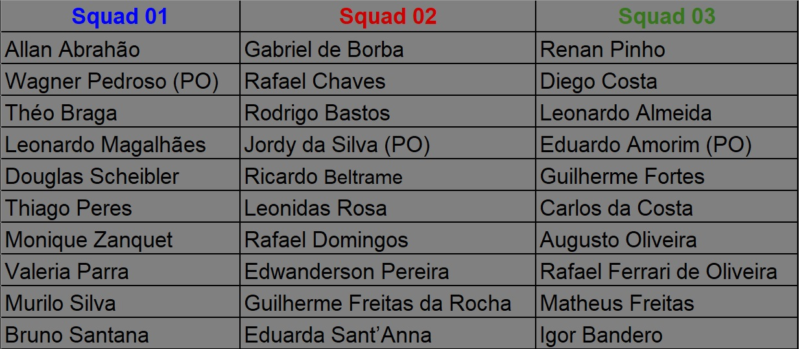

<h1 align="center"> Projeto PCP-Lab365 Backend </h1>
<h2 align="center"> 💻 Projeto avaliativo 2 do terceiro módulo do curso DevInHouse Senai / Senior Sistemas. 💻</h2>

<h3 align="center">***********🔧 INSTRUçÕES 🔧***********</h3>

Link repositório: https://github.com/DEVin-Senior/M3P2-PCP-Back-end

### Execução

Orientações para execução do programa:
- Criar no pgAdmin(PostgreSQL) um database com o nome ***pcp-backend***
- Acessar o arquivo ***./src/main/resources/application.properties*** e inserir a senha do seu database
- Execute o programa
Obs: clonar o frontend da aplicação em: https://github.com/DEVin-Senior/M3P2-PCP-Front-end

### Tecnologias utilizadas

- Maven: 3.8.6 -> https://maven.apache.org/download.cgi

- JDK: 17.0.2 -> https://jdk.java.net/archive/

- Spring 2.7.3 -> https://start.spring.io/

### Versão do projeto 1.0

### Informações sobre as branchs

- Squad 01: SQ01;
- Squad 02: SQ02;
- Squad 03: SQ03;
- Todas as squads: ALL (Branch sobre assuntos gerais que atingem todas as squads)

 

 ✒️ Autores ✒️ 

 
